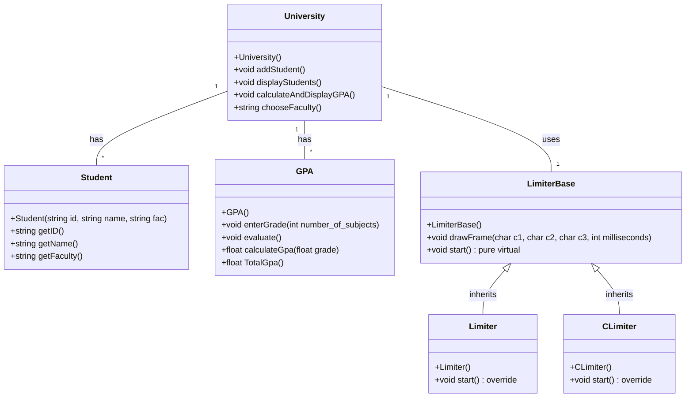

# College Management System
This project is made in Semester_#2 as utilizing OOP style programming in C++

# UML Class diagram

```mermaid
classDiagram
    class Student {
        +Student(string id, string name, string fac)
        +string getID()
        +string getName()
        +string getFaculty()
    }
    class GPA {
        +GPA()
        +void enterGrade(int number_of_subjects)
        +void evaluate()
        +float calculateGpa(float grade)
        +float TotalGpa()
    }
    class University {
        +University()
        +void addStudent()
        +void displayStudents()
        +void calculateAndDisplayGPA()
        +string chooseFaculty()
    }
    class LimiterBase {
        +LimiterBase()
        +void drawFrame(char c1, char c2, char c3, int milliseconds)
        +void start() pure virtual
    }
    class Limiter {
        +Limiter()
        +void start() override
    }
    class CLimiter {
        +CLimiter()
        +void start() override
    }

    University "1" -- "*" Student : has
    University "1" -- "*" GPA : has
    University "1" -- "1" LimiterBase : uses
    LimiterBase <|-- Limiter : inherits
    LimiterBase <|-- CLimiter : inherits

```